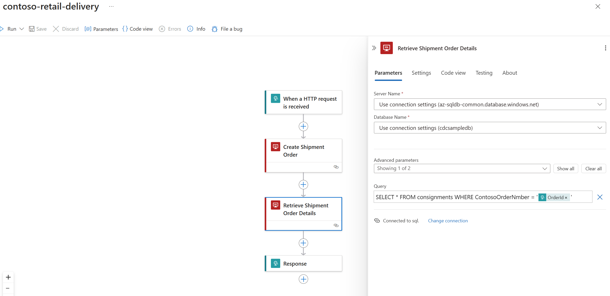
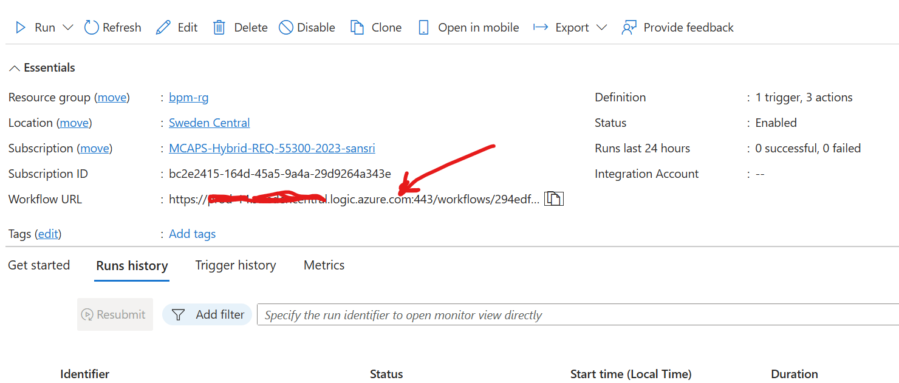

# AzureAI-AgentService-Retail-Shopping-Experience


This sample app is an Agentic AI bot designed to assist customers of Contoso Retail Fashion with their shopping needs. The primary goal of this app is to showcase the integration capabilities of the Azure AI Agent Service and the new **Microsoft Agent Framework**.

**Features**

- Users can search for products by category, by category & price, and order products - implemented as REST APIs hosted in Azure.
- After the order is created, users can create Shipment Order to deliver them - implemented using Azure Logic Apps.
- Built using the **Microsoft Agent Framework** for advanced agent orchestration and multi-agent capabilities.

**Key Highlights**

This app leverages both the Azure AI Agent Service and the new **Microsoft Agent Framework** announced at Ignite 2024. It showcases how these services can integrate with REST APIs and Azure Logic Apps.

### Microsoft Agent Framework Integration

This sample now includes an implementation using the **Microsoft Agent Framework**, a comprehensive SDK for building, orchestrating, and deploying AI agents. Key features include:

- **Native Azure OpenAI Integration**: Seamless integration with Azure AI services
- **Function Calling Tools**: Declarative function tools with type annotations for automatic schema generation
- **Modern Async Patterns**: Built with async/await for efficient concurrent operations
- **Enhanced Observability**: OpenTelemetry support for comprehensive tracing and monitoring
- **Multi-agent Support**: Foundation for future multi-agent orchestration patterns

The framework provides two implementation approaches:
1. **Legacy Implementation** (`agent.py`, `state_management_bot.py`): Uses Azure AI Projects SDK for direct agent management
2. **New Framework Implementation** (`agent_framework_implementation.py`): Uses Microsoft Agent Framework with advanced orchestration capabilities

### REST API and Function Calling

- REST API Integration: The app uses REST APIs that are Open API 3.0 compliant. Function calling tools automatically expose these APIs to the agent without requiring custom middleware.
- Azure Logic Apps Integration: Uses function calling to invoke Azure Logic Apps for creating shipment orders.

The sample App is built using the Microsoft Bot Framework and gpt-4o-mini model is used to process natural language input. 

**Notes**

- The REST APIs and Logic App used in this sample are very basic and are only meant to serve the purpose of demonstrating the integration capabilities.
- The code for the REST API is not included in this sample. However, the Swagger definition of the API hosted in Azure is provided.

### About the Azure AI Agent Service and Microsoft Agent Framework

**Azure AI Agent Service** builds on the capabilities of Assistants API of OpenAI, with additional features:
- Bing Search for data grounding
- Azure AI Search Integration
- REST APIs integration (implemented in this sample)
- Azure Function App Integration

**Microsoft Agent Framework** provides:
- Unified agent development across Python and .NET
- Multi-agent orchestration patterns (sequential, concurrent, group chat, handoff)
- Protocol support (Agent-to-Agent, Model Context Protocol)
- Process durability and human-in-the-loop control
- Cloud and provider agnostic deployment

In this sample, both the Azure AI Projects SDK and the Microsoft Agent Framework are available, demonstrating different approaches to building agentic AI applications.

### Getting Started

### Installation Steps

1. **Clone the repository**:
    
    ```sh
    git clone https://github.com/your-repo/retail-agentic-ai-service-assistant.git
    cd retail-agentic-ai-service-assistant/sales-ai-assistant/sales-ai-assist
    ```

2. **Create and activate a virtual environment**:
    
    ```sh
    python -m venv venv
    source venv/bin/activate  # On Windows use `venv\Scripts\activate`
    ```

3. **Install Python dependencies**:
    
    ```sh
    pip install -r requirements.txt
    ```

4. **Set up environment variables**:
    - Create a `.env` file in the root directory.
    - Add the necessary environment variables as .. see below.

    ```sh
    az_agentic_ai_service_connection_string="eastus.api.azureml.ms;<>;<>;ai-service-project..."
    az_application_insights_key="InstrumentationKey=aa460286-....."
    az_logic_app_url = "https://<your-app>.swedencentral.logic.azure.com:443/workflows/<>/triggers/When_a_HTTP_request_is_received/paths/invoke?api-version=2016-10-01&sp=%2Ftriggers%2FWhen_a_HTTP_request_is_received%2Frun&sv=1.0&sig=........."
    az_assistant_id = "asst_......."
    ```

5. Details of the dependent Services

### REST API: 

See the [Swagger definition](./data-files/swagger.json) of the API hosted in Azure

These are the sample APIs used: 
Search Products by category - [here](https://contosoretailfashions.azurewebsites.net/SearchProductsByCategory?category=winter%20wear)
Order Products - [here](https://contosoretailfashions.azurewebsites.net/OrderProduct?id=24&quantity=5)

### Logic App: 

For integration with the AI Agentic Service (or with Assistants API), the Logic App should implement a HTTP Request trigger, and have the last action as HTTP Response. All the actions in it must be configured to run synchronously. 

Refer to the documentation [here](https://learn.microsoft.com/en-us/azure/ai-services/openai/how-to/assistants-logic-apps) for more details. 

In order to run this sample, create a Logic App similar to the one described below. Its URL needs to be added in the .env configuration of the Bot App. 

The Logic App takes the order id for the items purchased, along with the destination address. It inserts the Shipment Order in an Azure SQL Database, and returns the details in its response. See below:



Refer to the Logic App definition file [here](./data-files/logic-app-definition.json) to create your own Logic App.


The Schema of the Logic App HTTP Request Body, below:

```json
{
    "type": "object",
    "properties": {
        "OrderId": {
            "type": "string"
        },
        "Destination": {
            "type": "string"
        }
    }
}
```

After creating the Logic App, get the URL to invoke it. See below:



The Logic App inserts the Delivery order into an Azure SQL Database table. The schema of the table used in this sample is provided below:

```t-sql

SET ANSI_NULLS ON
GO

SET QUOTED_IDENTIFIER ON
GO

CREATE TABLE [dbo].[consignments](
	[OrderID] [smallint] NOT NULL,
	[Consignee] [nvarchar](50) NOT NULL,
	[Origin] [nvarchar](50) NOT NULL,
	[Destination] [nvarchar](50) NOT NULL,
	[Weight_kg] [smallint] NULL,
	[Volume_m3] [float] NOT NULL,
	[FreightType] [nvarchar](50) NOT NULL,
	[OrderDate] [date] NULL,
	[EstimatedDeliveryDate] [date] NULL,
	[ActualDeliveryDate] [date] NULL,
	[Status] [nvarchar](50) NOT NULL,
	[ContosoOrderNmber] [nvarchar](50) NULL
) ON [PRIMARY]
GO

```

6. **Run the bot**:

    **Option 1: Using Legacy Azure AI Projects SDK**
    
    Create the Agent first by running agent.py. Take the id of the agent created and set the value in .env file

    ```sh
    python agent.py
    ```

    Now run the Bot Application using the Bot Framework Emulator
    
    ```sh
    python app.py
    ```

    **Option 2: Using Microsoft Agent Framework** (Recommended)
    
    Test the new agent framework implementation:

    ```sh
    python agent_framework_implementation.py
    ```
    
    This will create an agent using the Microsoft Agent Framework and run a test conversation.
    For interactive testing, you can uncomment the conversation loop in the main() function.
    
    See a demo of the App [here](https://youtu.be/hEfGQi7_NdE)


7. **Deploy to Azure**: (Optional step)
    - Follow the instructions in the [Azure Bot Service documentation](https://learn.microsoft.com/en-us/azure/bot-service/bot-service-quickstart?view=azure-bot-service-4.0) to deploy your bot to Azure.

    The App can be run using the Bot Framework emulator, locally.


### Additional Resources

**Microsoft Agent Framework:**
- [Microsoft Agent Framework Documentation](https://learn.microsoft.com/en-us/agent-framework/)
- [Microsoft Agent Framework GitHub Repository](https://github.com/microsoft/agent-framework)
- [Agent Framework PyPI Package](https://pypi.org/project/agent-framework/)
- [Getting Started with Microsoft Agent Framework](https://microsoft.github.io/ai-agents-for-beginners/14-microsoft-agent-framework/)

**Azure AI Services:**
- [Azure AI Agent Service Documentation](https://learn.microsoft.com/en-us/azure/ai-services/agents/)
- [Azure AI Foundry Documentation](https://learn.microsoft.com/en-us/azure/ai-foundry/)

**Bot Framework & Azure Services:**
- [Microsoft Bot Framework Documentation](https://learn.microsoft.com/en-us/azure/bot-service/)
- [Azure Logic Apps Documentation](https://learn.microsoft.com/en-us/azure/logic-apps/)
- [Bot Framework Emulator](https://github.com/Microsoft/BotFramework-Emulator/releases/tag/v4.15.1)
- [Using the Bot Framework Emulator to run the Bot App](https://learn.microsoft.com/en-us/azure/bot-service/bot-service-debug-emulator?view=azure-bot-service-4.0&tabs=python)
