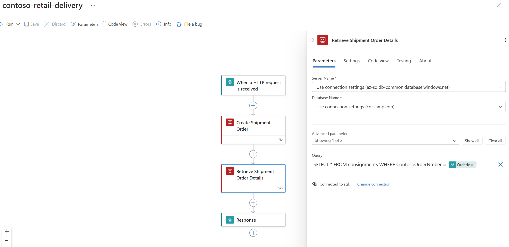
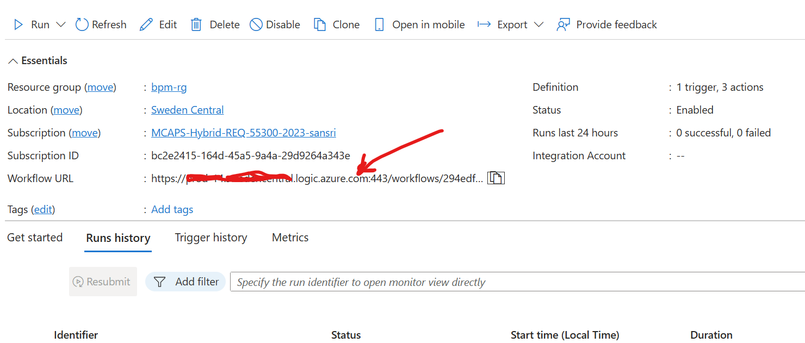

# AzureAI-AgentService-Retail-Shopping-Experience


This sample app is a Agentic AI bot designed to assist customers of Contoso Retail Fashion with their shopping needs. The primary goal of this app is to showcase the integration capabilities of the Azure AI Agent Service.

**Features**

- Users can search for orders by category, by category & price, and order products - implemented as REST APIs hosted in Azure.
- After the order is created, users can create Shipment Order to delivery them - implemented using Azure Logic Apps.

**Key Highlights**

This app leverages the Azure AI Agent Service, which was announced at Ignite 2024. It showcases how the service can integrate with REST APIs and Azure Logic Apps.
- REST API Integration: The app uses REST APIs that are Open API 3.0 compliant. By providing the Swagger definition, the Azure AI Agent Service can automatically call the appropriate API or action based on user input, without requiring custom code. This is similar to how custom GPTs support actions in OpenAI.
- Azure Logic Apps Integration: While direct action/integration with Azure Logic Apps is not yet available in the Azure AI Agent Service, this sample uses function calling to invoke Azure Logic Apps for creating shipment orders.

The sample App is built using the Microsoft Bot Framework and gpt-4o-mini model is used to process natural language input. 

**Notes**

- The REST APIs and Logic App used in this sample are very basic and are only meant to serve the purpose of demonstrating the integration capabilities of the Azure AI Agent Service.
- The code for the REST API is not included in this sample. However, the Swagger definition of the API hosted in Azure is provided.

### About the Azure AI Agent Service
The Azure AI Agent Service builds on the capabilities of Assistants API of OpenAI, like access to tools like Code interpreter, turnkey Knowledge search using File Search, and Function Calling. In addition the Azure AI Agent Service provides the following knowledge tools integration:
- Bing Search for data grounding
- Azure AI Search Integration

It supports the following Actions Integration:
- REST APIs integration (implemented in this sample)
- Azure Function App Integration(not included in this sample)

In this sample, the Azure AI Agentic Service SDK is consumed in an App built using the Microsoft Bot Framework. This Bot App can be hosted in Azure App Service, Azure Container Apps, Azure Function Apps, or even on other Cloud platforms.

### Getting Started

### Installation Steps

1. **Clone the repository**:
    
    ```sh
    git clone https://github.com/your-repo/retail-agentic-ai-service-assistant.git
    cd retail-agentic-ai-service-assistant/sales-ai-assistant/sales-ai-assist
    ```

2. **Create and activate a virtual environment**:
    
    ```sh
    python -m venv venv
    source venv/bin/activate  # On Windows use `venv\Scripts\activate`
    ```

3. **Install Python dependencies**:
    
    ```sh
    pip install -r requirements.txt
    ```

4. **Set up environment variables**:
    - Create a `.env` file in the root directory.
    - Add the necessary environment variables as .. see below.

    ```sh
    az_agentic_ai_service_connection_string="eastus.api.azureml.ms;<>;<>;ai-service-project..."
    az_application_insights_key="InstrumentationKey=aa460286-....."
    az_logic_app_url = "https://<your-app>.swedencentral.logic.azure.com:443/workflows/<>/triggers/When_a_HTTP_request_is_received/paths/invoke?api-version=2016-10-01&sp=%2Ftriggers%2FWhen_a_HTTP_request_is_received%2Frun&sv=1.0&sig=........."
    az_assistant_id = "asst_......."
    ```

5. Details of the dependent Services

### REST API: 

See the [Swagger definition](./data-files/swagger.json) of the API hosted in Azure

These are the sample APIs used: 
Search Products by category - [here](https://contosoretailfashions.azurewebsites.net/SearchProductsByCategory?category=winter%20wear)
Order Products - [here](https://contosoretailfashions.azurewebsites.net/OrderProduct?id=24&quantity=5)

### Logic App: 

For integration with the AI Agentic Service (or with Assistants API), the Logic App should implement a HTTP Request trigger, and have the last action as HTTP Response. All the actions in it must be configured to run synchronously. 

Refer to the documentation [here](https://learn.microsoft.com/en-us/azure/ai-services/openai/how-to/assistants-logic-apps) for more details. 

In order to run this sample, create a Logic App similar to the one described below. Its URL needs to be added in the .env configuration of the Bot App. 

The Logic App takes the order id for the items purchased, along with the destination address. It inserts the Shipment Order in an Azure SQL Database, and returns the details in its response. See below:



Refer to the Logic App definition file [here](./data-files/logic-app-definition.json) to create your own Logic App.


The Schema of the Logic App HTTP Request Body, below:

```json
{
    "type": "object",
    "properties": {
        "OrderId": {
            "type": "string"
        },
        "Destination": {
            "type": "string"
        }
    }
}
```

After creating the Logic App, get the URL to invoke it. See below:



The Logic App inserts the Delivery order into an Azure SQL Database table. The schema of the table used in this sample is provided below:

```t-sql

SET ANSI_NULLS ON
GO

SET QUOTED_IDENTIFIER ON
GO

CREATE TABLE [dbo].[consignments](
	[OrderID] [smallint] NOT NULL,
	[Consignee] [nvarchar](50) NOT NULL,
	[Origin] [nvarchar](50) NOT NULL,
	[Destination] [nvarchar](50) NOT NULL,
	[Weight_kg] [smallint] NULL,
	[Volume_m3] [float] NOT NULL,
	[FreightType] [nvarchar](50) NOT NULL,
	[OrderDate] [date] NULL,
	[EstimatedDeliveryDate] [date] NULL,
	[ActualDeliveryDate] [date] NULL,
	[Status] [nvarchar](50) NOT NULL,
	[ContosoOrderNmber] [nvarchar](50) NULL
) ON [PRIMARY]
GO

```

6. **Run the bot**:

    Create the Agent first by running agent.py. Take the id of the agent created and set the value in .env file

    ```sh
    python agent.py
    ```

    Now run the Bot Application using the Bot Framework Emulator
    
    ```sh
    python app.py

    ```
    
    See a demo of the App [here](https://youtu.be/hEfGQi7_NdE)


7. **Deploy to Azure**: (Optional step)
    - Follow the instructions in the [Azure Bot Service documentation](https://learn.microsoft.com/en-us/azure/bot-service/bot-service-quickstart?view=azure-bot-service-4.0) to deploy your bot to Azure.

    The App can be run using the Bot Framework emulator, locally.


### Additional Resources

- [Azure AI Agent Service Documentation](https://learn.microsoft.com/en-us/azure/ai-services/agents/)
- [Microsoft Bot Framework Documentation](https://learn.microsoft.com/en-us/azure/bot-service/)
- [Azure Logic Apps Documentation](https://learn.microsoft.com/en-us/azure/logic-apps/)
- [Bot Framework Emulator](https://github.com/Microsoft/BotFramework-Emulator/releases/tag/v4.15.1)
- [Using the Bot Framework Emulator to run the Bot App](https://learn.microsoft.com/en-us/azure/bot-service/bot-service-debug-emulator?view=azure-bot-service-4.0&tabs=python)
